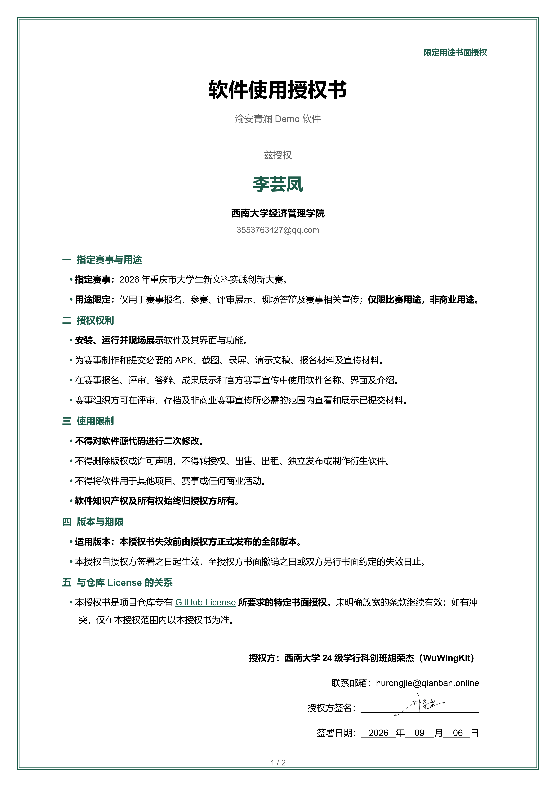
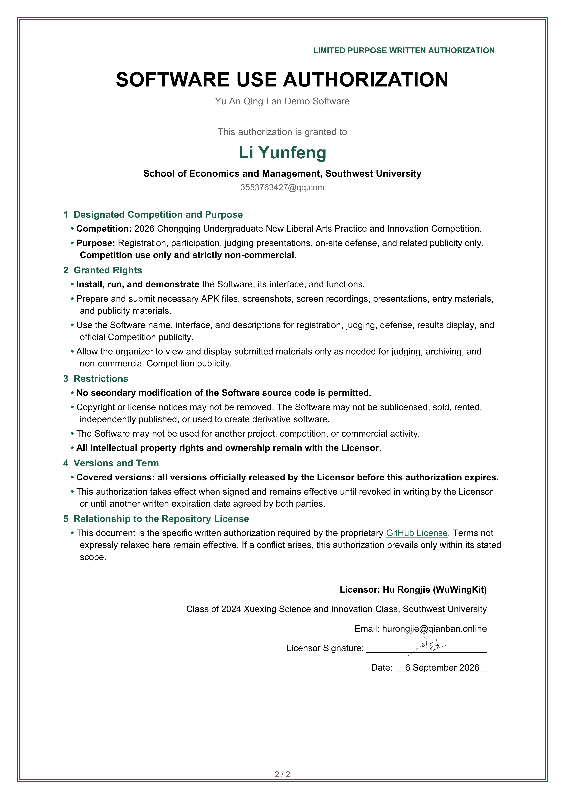

# 软件授权记录

本页公开记录“渝安青澜”软件依据仓库 [专有 License](../LICENSE) 作出的有效书面授权。除下列明确授权外，仓库 License 中保留所有权利及禁止未经书面授权利用的条款继续有效。

## 李芸凤 2026年重庆市大学生新文科实践创新大赛

- **被授权方：** 西南大学经济管理学院李芸凤（`3553763427@qq.com`）
- **授权用途：** 参与“2026年重庆市大学生新文科实践创新大赛”，包括报名、评审展示、现场答辩、成果展示及赛事相关宣传。
- **授权性质：** 仅限比赛用途，非商业用途。
- **授权权利：** 可安装、运行和展示软件；可为指定赛事制作和提交必要的 APK、截图、录屏、演示文稿、报名及宣传材料；赛事组织方可在评审、存档及非商业赛事宣传所必需的范围内查看和展示已提交材料。
- **主要限制：** 不得对软件源代码进行二次修改；不得删除版权或许可声明；不得转授权、出售、出租、独立发布、用于其他项目或赛事，亦不得制作衍生软件。
- **适用版本：** 本授权书失效前由授权方正式发布的全部版本。
- **生效日期：** 2026年09月06日。
- **授权状态：** 有效，至授权方书面撤销或双方另行书面约定失效时止。

本授权属于仓库专有 License 所要求的特定书面授权，仅在上述范围内优先适用，不构成对公众或其他主体的许可。

### 中文授权书

### English Authorization

授权方：西南大学24级学行科创班胡荣杰（WuWingKit）  
联系邮箱：`hurongjie@qianban.online`
